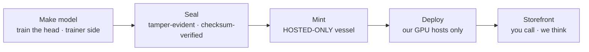

PUBLIC BY MIRROR — this file ships to reflex.gist.rs; keep it concept-level (no code, no repo paths, no digests, no measured numbers)

# Rethink — the development flow

How a Rethink head travels from training to serving. The head is trained
on the trainer side, sealed [made tamper-evident and checksum-verified],
minted into a HOSTED-ONLY vessel [weights that never leave our servers —
you call, we think], deployed to our GPU hosts, and served through the
storefront. No step ever places the weights on hardware we do not
control — that is the point of the flow.

